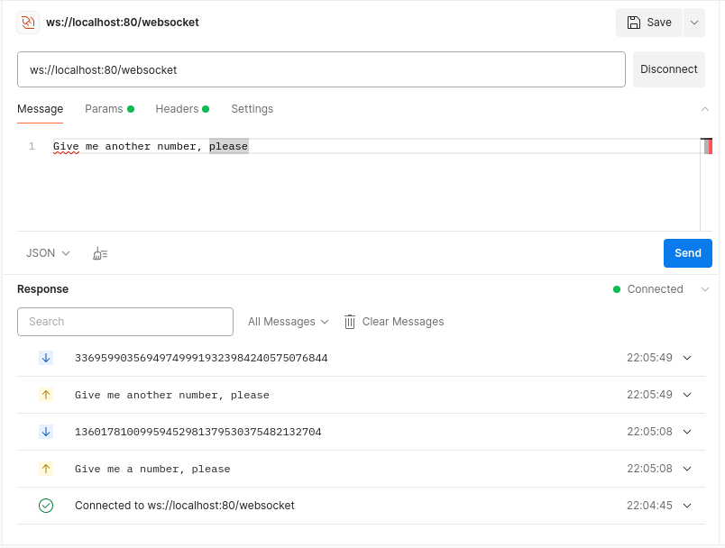

## Запуск сервера

```shell
mvn clean package jib:dockerBuild
docker run -p80:8025 randonumber
```

## Использование

### Postman
- Создать новое WebSocket подключение

```http request
ws://localhost:80/websocket
```
- Отправить любое сообщение
- Получить в ответ случайное число

